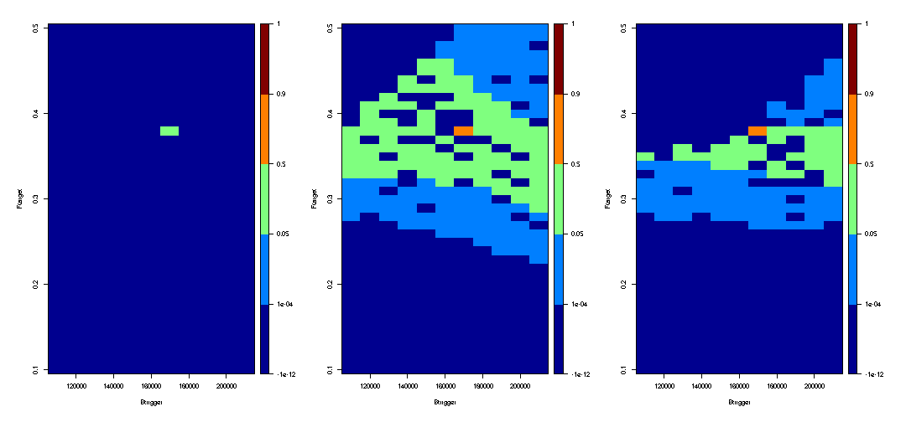
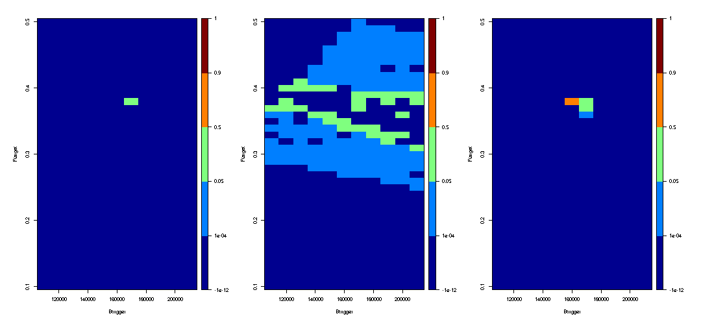

# Abstract

This project introduces a computationally efficient framework for evaluating Harvest Control Rules (HCRs). Initially applied to a single-stock fishery, the framework utilises Gaussian process regression to independently model both catch and risk. Then, by combining the methods of Bayesian history matching, acquisition functions and k-means clustering, we are able to systematically map the parameter space. This drastically reduces the need for expensive simulation runs.

Building on this foundation, we scale up this framework to complex mixed-fisheries scenarios. Here, the objective becomes identifying the fishing mortality for each of the interacting stocks that safely maximizes total long-term catch. This framework provides a powerful tool for marine policy by significantly reducing the computational burden of mixed-fishery MSEs whilst ensuring that the stocks remain both economically viable and firmly within safe biological limits. However, there are limitations to our current work which we discuss throughout and summarise when suggesting further developments.

# Introduction

Sustainable fisheries management requires a delicate balance of maximising long-term catch whilst keeping the risk of stock depletion below precautionary thresholds [@ICES2021precautionary]. Traditionally, Management Strategy Evaluation (MSE) grid searches are used to find optimal HCRs [@Harvest_Control_Rules],[@ICES2019WKGMSE2]. However, simulating the complex, interconnected dynamics found in fisheries is computationally expensive and time-consuming, particularly as management shifts from single-stock assessments to more realistic, multispecies mixed fisheries [@Originalpaper],[@MixedFisheriesStatusandManagement2023],[@MixME].

## Key Concepts

We firstly introduce some of the key concepts in fisheries management which will be used throughout this paper. One of these is catch. Unfortunately, there are many different definitions of this term [@ICES2021precautionary],[@MixME],[@aquaculture2024state].The most commonly used is the ICES definition where catch includes wanted catch, unwanted catch and unaccounted removals [@ICES2019CodAdvice]. Wanted catch refers to the wanted catch that has commercial value. Unwanted catch refers to the portion of the catch that is thrown back into the sea for being undersized, having no commercial value or the fleet not having enough quota to land it. Unaccounted removals comes from ICES filling in the gaps in their historical data, and so is not particularly relevant for this project [@ICES2019CodAdvice],[@ICES2021precautionary]. However, some papers may use equations to describe catch which do not take all of these factors into account. We will try to make clear when this is happening in this paper. - ACTUALLY NEED TO DO

Risk is another key concept. We define risk using the ICES Prob3 definition as the maximum probability that $SSB$ is below $B_{lim}$, where the maximum (of the annual probabilities) is taken over a certain number of years [@ICES2019WKGMSE2]. There have also been different definitions of this term, but we will use the definition of risk above throughout this paper as it is the version recommended by ICES [@ICES2019WKGMSE2].

Some other important concepts in fisheries management are fishing mortality and the biomass limit reference point. The fishing mortality of a specific stock, normally denoted as $F_{target}$, is defined as what proportion of fish are killed due to fishing form that specific stock [@lart2026guide]. The biomass limit reference point, often denoted as $B_{lim}$, is defined as the limit where stocks with a spawning stock biomass ($SSB$) below this level may not have high enough recruitment to sustain a fishery [@lart2026guide].

Furthermore, we need to discuss the difference between single-stock and mixed fisheries. Single-stock fisheries consist of only one stock and can be fished by any number of fleets [@ICES2021precautionary]. On the other hand, mixed fisheries consist of multiple stock and can be fished by any number of fleets [@MixedFisheriesStatusandManagement2023]. Both types of fishery are normally constrained to a specific geographic area [@ICES2021precautionary]. Mixed fisheries are more difficult to manage due to interspecies (trophic) interactions and because gear often catches multiple species at once, which can lead to choke stocks [@MixedFisheriesStatusandManagement2023],[@MixME]. Choke stocks are where the amount we are allowed to catch (the quota) of one stock means that the quota for other stocks cannot be met [@MixedFisheriesStatusandManagement2023].

Lastly, we will discuss briefly the ideas of optimisation and Management Strategy Evaluation. In this paper, we use optimisation to find the maximum value of a function over a specific set of parameters [@Originalpaper]. There are various methods for this when the function is considered as a black-box, some of which we will discuss and use below [@EfficientGlobalOptimizationofExpensiveBlackBoxFunctions],[@GlobalOptimizationofStochasticBlackBoxSystemsviaSequentialKrigingMetaModels]. Management Strategy Evaluation is a tool used in fisheries management to decide whether a specific management strategy (say a HCR) can achieve the pre-agreed management objectives [@Harvest_Control_Rules_2]. These management objectives may require careful balancing, such as wanting to harvest enough fish to feed a large population whilst protecting the stock for future years, and are given quantitative expressions [@Harvest_Control_Rules_2].

## Previous Work and Structure of this Paper

There has been much previous work on this problem. MSEs to test HCRs for single-stock fisheries are a well-established method of fisheries management, being used by ICES to implement single-stock Total Annual Catches (TACs) and thus are widely adopted [@ICES2019WKGMSE2], [@Harvest_Control_Rules_2]. One of the most recent papers on MSEs for single-stock fisheries uses Gaussian Processes to estimate the results of a simulation, due to the simulation being expensive to evaluate [@Originalpaper]. This was helped by previous developments in diverse fields [@EfficientGlobalOptimizationofExpensiveBlackBoxFunctions],[@GlobalOptimizationofStochasticBlackBoxSystemsviaSequentialKrigingMetaModels],[@BayesianOptimisationTutorial].

However, for many years researchers have realised that a single-stock approach is not sufficient [@ULRICH201238],[@MixedFisheriesStatusandManagement2023]. This has led to a growth in literature relating to how to manage mixed fisheries, which we are building on in @sec-mixedfisheries of our report [@ULRICH201238],[@MixedFisheriesStatusandManagement2023],[@MixME]. The MSEs for mixed fisheries tend to be more complicated than for single-stock fisheries as they take more factors into account [@ULRICH201238],[@MixME]. Thus, finding ways to improve MSE grid searches in a single stock context and then applying this method to mixed fisheries contexts could be beneficial for the fishing industry [@Originalpaper],[@MixME],[@ParallelandOtherSimulationsInRMadeEasy]. This is our intention throughout this paper. We describe the framework outlined in the abstract in detail with applications to a couple of scenarios, the results of which are discussed in @sec-analysingresults. We also suggest areas for further development of the method in @sec-conclusionandfurtherdevelopment.

In the @sec-singlestock part of the project, we build on @Originalpaper. We focus on enhancing the methods in the paper by adding acquisition functions and k-means clustering to improve how we choose to sample points between rounds as this was not deeply considered in the original paper [@Originalpaper],[@BayesianOptimisationTutorial],[@EfficientGlobalOptimizationofExpensiveBlackBoxFunctions],[@GlobalOptimizationofStochasticBlackBoxSystemsviaSequentialKrigingMetaModels]. The aim of the second half of the project in @sec-mixedfisheries is to apply the methods from @sec-singlestock to a more realistic mixed fisheries scenario and to demonstrate how effective our method may be if used in the industry [@BayesianOptimisationTutorial],[@MixME],[@MixedFisheriesStatusandManagement2023].

# Creating the framework in a single stock fisheries context {#sec-singlestock}

## General theory

We will look at the mathematics behind the methods in @Originalpaper above and also at the acquisition functions which I have added to the original code. For a comprehensive introduction to the general theory on Gaussian processes, Maximum Likelihood Estimation and Gaussian Process Regression see @BayesianOptimisationTutorial.

### Gaussian Processes

A Gaussian Process $F$ has a mean function $\mu_0$ and a covariance function $\operatorname{cov}_0(x_i,x_j)$. We can then evaluate the covariance function $\operatorname{cov}_0(x_i,x_j)$ for every pair $x_i,x_j$ where $i,j\in\{1, ..., n\}$ to find the covariance matrix $\Sigma_{1:n}$ . Then, $F$ is a probability distribution over our objective function $f$ with the property that, for any given collection of points ${x_1,...x_n}$, the marginal probability distribution on $F(x_{1:n}) = (F(x_1),...,F(x_n))$ is given by:

$$
F(x_{1:n}) \sim N(\mu_0(x_{1:n}),\Sigma_{1:n})
$$ {#eq-MultivariateNormalDist}

where

$$
\mu_0(x_{1:n}) = (\mu_0(x_1), . . ., \mu_0(x_n))
$$

We choose a covariance function such that the inputs that have nearby points that have been evaluated have a more certain output than points that are further away from the points that have been evaluated [@Originalpaper] - UNCLEAR, FIND A BETTER WAY TO EXPRESS.

This is equivalent to saying that if for some $x,x',x''$ in the parameter space we have $\|x - x'\| < \|x -x''\|$ for some norm $\| \cdot \|$, then $\operatorname{cov}_0(x, x') > \operatorname{cov}_0(x, x'')$.

We use a GP to emulate the objective function because it is much cheaper to evaluate than our objective function. We can use the GP $F(x)$ for any $x$ in the parameter space as our estimate of $f(x)$ based on our current beliefs. - UNCLEAR

This is true even for the evaluated points $x_1,...,x_m$ as the GP is fitted to these points [@Originalpaper].

### Maximum Likelihood Estimation

When using GPs to emulate our objective function, we need to be able to estimate the hyperparameters of the GP using the data we gain from evaluating our points $x_1,...,x_n$.

We can do this as follows. Firstly, we let the vector $\eta$ represent the hyperparameters that give us $\mu_0$ and $\operatorname{cov}_0$. Then, given the observations $f(x_{1:n}) = (f(x_1),...,f(x_n))$, we calculate the likelihood of these observations under the prior given $\eta$ which is denoted as $p(f(x_{1:n})|\eta)$ and modelled by @eq-MultivariateNormalDist. - UNDER THE PRIOR IS UNCLEAR

Lastly, we set $\hat{\eta}$ to the value that maximizes this likelihood:

$$
 \hat{\eta} = argmax_\eta p(f(x_{1:n})|\eta)
$$

### Gaussian Process Regression {#sec-gaussianprocessregression}

Gaussian process regression is a Bayesian statistical method for modelling functions. Again, let $f$ be the objective function and we focus on the parameter space $X := \{x_1,...,x_k\}$. Now, if we have evaluated $n$ points such that we have $f(x_{1:n})$ and want to evaluate $x_{n+1}$ we let $k = n+1$ in @eq-MultivariateNormalDist . - THINK ABOUT WHAT I REALLY WANT TO EVALUATE HERE. IT IS LIKELY DESCRIBED IN THE NEXT SENTENCE.

Then, we can compute the conditional distribution of $F(x_{n+1})$ given $f(x_{1:n})$ using Bayes' rule:

$$
F(x_{n+1})|f(x_{1:n}) \sim N(\mu_n(x_{n+1}), \sigma^2_n(x_{n+1}))
$$ {#eq-posteriordistributiongivensamples}

where:

$$
\mu_n(x_{n+1}) = \operatorname{cov}_0(x_{n+1}, x_{1:n})(\Sigma_{1:n})^{-1}(f(x_{1:n}) - \mu_0(x_{1:n}))  + \mu_0(x_{n+1})
$$

$$
\sigma^2_n(x_{n+1}) = \operatorname{cov}_0(x_{n+1},x_{n+1}) - \operatorname{cov}_0(x_{n+1}, x_{1:n})(\Sigma_{1:n})^{-1}\operatorname{cov}_0(x_{1:n},x_{n+1})
$$

where:

$$
\operatorname{cov}_0(x_{n+1}, x_{1:n}) = (\operatorname{cov}_0(x_{n+1}, x_1), ... , \operatorname{cov}_0(x_{n+1}, x_n))
$$

This conditional distribution $F(x_{n+1})|f(x_{1:n})$ is called the posterior probability distribution for $x_{n+1}$. - CHECK IF THIS IS FOR F(x\_{n+1}) INSTEAD

We can calculate this distribution for every point in the parameter space $X$. This results in a new GP $F_n$ with a mean vector and covariance kernel that depend on the location of the unevaluated points, the locations of the evaluated points $x_{1:n}$, and their values $f(x_{1:n})$. So, we can update our GP every round based on the new points we have evaluated.

### Bayesian History Matching {#sec-bhm}

For the theory here, please see @Originalpaper. Let $x$ be a point in the parameter space. We begin with some uncertainty about a function we are emulating with a GP, say $\alpha(x)$, and want to find it's maximum. We can make probabilistic statements such as:

$$
P(\alpha(x)>a)= \int_{a}^{\infty}P(\alpha(x))d\alpha(x)
$$

Once we evaluate another point $x_1$ where $x_1 \neq x$, we are able to use Bayes' Theorem improve our integral to:

$$
P(\alpha(x)>a|\alpha(x_1))= \int_{a}^{\infty}P(\alpha(x)|\alpha(x_1))d\alpha(x)
$$

We now let $a=max\{f(x_1),...,f(x_n)\}$ where $n$ is the number of points we have evaluated so far. As the rounds increase we make sure to include all previous points of the objective function that have been evaluated. We remove the point $x$ from the list of plausible points if:

$$
P(\alpha(x)>a|\alpha(x_{1:n})) = \int_{a}^{\infty}P(\alpha(x)|\alpha(x_{1:n}))d\alpha(x) <\varepsilon
$$ {#eq-removeimplausiblepoint}

for a small $\varepsilon > 0$ until no plausible points remain. Then, the optimum will be $x^*$ such that:

$$
\alpha(x^*) = max\{\alpha(x_{1:n})\}
$$

as our index $n$ counts the number of points we have evaluated throughout the whole simulation.

### Expected Improvement

The first type of acquisition function we will look at is Expected Improvement (EI). Suppose we have sampled the points $x_1, ... ,x_n$ and observe the values $f(x_{1:n})$. Then, if we were to return a solution at this point, bearing in mind we observe the objective function $f$ without noise and we can only return points we have already evaluated, we would return $f^*_n = max\{f(x_1),...,f(x_n)\}$ [@BayesianOptimisationTutorial]. Imagine we then consider evaluating another point $x_{n+1}$ to get $f(x_{n+1})$. We can then define the Expected Improvement as:

$$
EI_n(x_{n+1}) := E[(F(x_{n+1})|f(x_{1:n})-f^*_n)^+]
$$

where $[(F(x_{n+1})-f^*_n)^+]$ is the positive part of $[F(x_{n+1})-f^*_n]$. This acquisition function is relatively easy to optimise and many different methods have been developed for doing this [@BayesianOptimisationTutorial].

There is another expression for $EI_n(x_{n+1})$:

$$
EI_n(x_{n+1}) =  [((\mu_n(x_{n+1})-f_n^*)\cdot\Phi(Z)+\sigma_n(x_{n+1})\cdot\phi(Z))^+]
$$ {#eq-EIincode}

where again the notation $[(\cdot)^+]$ means the positive part and where:

$$
Z = \frac{\mu_n(x_{n+1})-f_n^*}{\sigma_n(x_{n+1})}
$$

@eq-EIincode can be gained from @eq-MultivariateNormalDist by setting $k = n+1$ and then studying the distribution of $F(x_{n+1})-f^*_n$. However, we can also consider it as a version of Equation 15 from @EfficientGlobalOptimizationofExpensiveBlackBoxFunctions where we first flip the signs as we are focused on the maximisation case and then set $f_{min} = f^*_n$, $\hat{y} = \mu_n(x)$ and $s = \sigma_n(x)$.

### Augmented Expected Improvement

This was included to help make the method perform better for noisy functions which will make it more generally applicable [@GlobalOptimizationofStochasticBlackBoxSystemsviaSequentialKrigingMetaModels]. To deal with these noisy observations, a change was proposed to the standard EI function as detailed below. This change seems mostly to have been justified by empirical performance [@letham2018constrainedbayesianoptimizationnoisy]. By adjusting Equation 12 found in @GlobalOptimizationofStochasticBlackBoxSystemsviaSequentialKrigingMetaModels to our own notation, we get that:

$$
AEI_n(x_{n+1})=E[(F(x_{n+1})|f(x_{1:n})-f^*_{eb})^+]\Biggl(1- \frac{\sigma_{obs}}{\sqrt{\sigma_n^2(x_{n+1})+\sigma_{obs}^2}}\Biggr)
$$

where $\sigma_{obs}$ is the standard deviation of the noise variable set by the user and $\sigma_n(x)$ is the standard deviation of GP $F$ at the $n^{th}$ iteration, as used beforehand. We have also changed $f^*_n$ to $f^*_{eb}$ which is the highest predicted mean at any sampled point so far so that we take into account that the uncertainty in our observations could cause a large spike [@GlobalOptimizationofStochasticBlackBoxSystemsviaSequentialKrigingMetaModels].

### Knowledge Gradient

We remove the assumption of EI that we have to return a pre-evaluated point as our best point [@BayesianOptimisationTutorial]. We also now start by saying that the solution we would choose if we have to stop sampling after $n$ points would be the point in the parameter space with the largest $\mu_n(\cdot)$ value, where $\mu_n(\cdot)$ is the mean vector of the posterior probability distribution after $n$ iterations. - WHY IS mu_n A VECTOR?

We call this maximum ${x_n^*}$ and then we can say that $F(x_n^*)$ is random under the posterior distribution and has the mean vector after sampling $f(x_{1:n})$ of:

$$
\mu_n^* := \mu_n(x_n^*) = max_{x}\mu_n(x)
$$

where $x$ is any point in the parameter space [@BayesianOptimisationTutorial]. Then, we imagine that we are now allowed to sample a new point $x_{n+1}$. We get a new posterior distribution at the point $x$ which we can calculate using @eq-posteriordistributiongivensamples by replacing $x_{n+1}$ with $x$ and $x_{1:n}$ with $x_{1:n+1}$ to include our new observation. This will have the posterior mean function $\mu_{n+1}(\cdot)$ defined as:

$$
\mu_{n+1}(x) = \mu_n(x) + \frac{\operatorname{cov}_n(x_{n+1},x)}{\operatorname{var}_n(x_{n+1}) + \sigma_{\mathrm{obs}}^2}(F(x_{n+1})|f(x_{1:n})-\mu_n(x_{n+1}))
$$ {#eq-updatemuKG}

where $\sigma_{obs}$ is a noise variable which can be determined by the user [@ungredda2022efficientcomputationknowledgegradient]. The conditional expected value for $F(x_n^*)$ changes to be:

$$
\mu_{n+1}^* := max_x\mu_{n+1}(x)
$$

So, we can see that the increase in the conditional expected value of $F(x_n^*)$ by sampling the new point $x_{n+1}$ is:

$$
\mu_{n+1}^* - \mu_n^*
$$ {#eq-increaseinconditionalexpectedvalue}

While this quantity is unknown before we sample $x_{n+1}$, we can calculate it's expected value given our observations $x_1,...,x_n$. The Knowledge Gradient (KG) for sampling at a new point $x$ in the parameter space is defined as [@BayesianOptimisationTutorial]:

$$
KG_n(x) := E[\mu_{n+1}^* - \mu_n^*|x_{n+1} = x]
$$ {#eq-KnowledgeGradient}

The easiest way to calculate the KG is via simulation. This can be done by simulating one possible value for $f(x_{n+1})$ and then calculating @eq-increaseinconditionalexpectedvalue. We iterate this process many times so that we can find the average of $\mu_{n+1}^* - \mu_n^*$ and this allows us to estimate $KG_n(x)$ [@BayesianOptimisationTutorial]. This process, or calculating $KG_n(x)$ directly from the properties of the normal distribution, both work well in discrete, low dimensional problems which is the situation we are in for the first half of the project [@BayesianOptimisationTutorial]. We would sample the point $x$ with the largest $KG_n(x)$ as our next point [@BayesianOptimisationTutorial].

### K-means process for selecting multiple points {#sec-kmeansgeneral}

Combining a clustering method with an acquisition function was an idea I had early on in the project. I was then able to find literature on the subject, including using k-means clustering. For the general theory on k-means processes and an algorithm for implementing a k-means process on computers, please see @kodinariya2013review and @AKMeansClusteringAlgorithm.

Let us have the parameter space $X$ as before. We want to be able to select multiple points to sample in our next round so that we continue the pattern set up in the original paper, whilst keeping a good trade off between exploration and exploitation [@batchspreadingoutjustification]. So, we use the k-means clustering method, which is the most commonly used due to its simplicity compared to other clustering algorithms.

This algorithm creates $k$ clusters (groups of points) such that the points within each cluster have the sum of squares to the centre of their cluster smaller than it would be to the centre of any other cluster [@kmeansdocumentation]. It starts by defining $k$ centroids which should be placed as much as possible far away from each other. Then, we take each point in the space and associate it to the nearest centroid. We stop when every point has been assigned to a centroid. At this point, we re-calculate $k$ new centroids as the centers of the clusters created by the previous step. This may result in some points changing clusters. We repeat this process until no points change clusters.

However, before the algorithm can start, we must specify how many clusters we want. This can be difficult in many cases. In our case, it is relatively simple as we know how many points we want to sample next and so we set this to be the number of clusters. Lastly, we run the algorithm on $X$ to form the clusters and then we pick the point with the highest value of the acquisition function from each cluster to sample in our next round.

## Application of theory in this half of my project {#sec-application}

### Context

WHICH TYPE OF CATCH DOES MIKE USE?

We have the objective function @eq-objectivefunctionsinglestock in @Originalpaper which combines the risk and the catch and so this is the function we want to maximise to get our maximum median long-term catch with the constraint of $risk \le 0.05$. To do this, the paper takes a Bayesian History Matching (BHM) approach. Firstly, we sample eight points which are spaced evenly throughout the parameter space to get some initial data. Then, for each round we do the following:

-   We set up or update the Gaussian Process (GP) to model $\ln(risk)$ and the GP to model $\ln(median\ catch)$

-   We use the GP modelling $\ln(risk)$ to get the value for the risk at each point in the parameter space

-   We then use the risk as a threshold so that we only consider the values of $F_{target}$ and $B_{trigger}$ that have a high probability of having risk below 0.05

-   We use the GP which is modelling $\ln(median\ catch)$ to get the value for the median catch at every point in the parameter space, which will have some uncertainty

-   We use BHM to remove any points that are implausible (that have a low probability of being higher than the current best median catch)

-   We create eight clusters and select the point with the highest value of the acquisition function from each cluster. These are the eight points we sample in the next round.

We are sampling eight points per round to reduce computation time [@HumanOutOfTheLoopBayesian],[@Originalpaper]. This can be increased if we increase the number of cores we have available, as seen in the second half of this paper [@HumanOutOfTheLoopBayesian].

### Set up the Gaussian Processes {#sec-setupGPs}

This process was described briefly in @Originalpaper and I repeat it here in more detail to help the reader. We are focusing on maximising the objective function from the paper which is given below:

$$
f(\theta) = I_{[0.95,1]}(P(B(\theta)>B_{lim})) \times C(\theta)
$$ {#eq-objectivefunctionsinglestock}

where for a parameter:

$$
\theta = (F_{target},B_{trigger})
$$

in the parameter space we have that $C(\theta)$ is the median long term catch, $B(\theta)$ is the long-term $SSB$ and:

$$
I_{[0.95,1]}(x) = 
\begin{cases}
1 & \text{if   } x\in[0.95,1] \\
0 & \text{otherwise }
\end{cases}
$$

is an indicator function. Here, @Originalpaper defines $risk$ as:

$$
risk = P(B(\theta)<B_{lim})
$$ {#eq-risk}

Hence, this indicator function tells us if $1-risk \ge 0.95$ and so if $risk \le 0.05$ which is what we desire for our precautionary threshold.

To maximise the objective function, @Originalpaper uses two GPs where the risk GP models $\ln(risk)$ and the catch GP models $\ln(C(\theta))$. Maintaining the notation from @Originalpaper, we use $m_1$ for the mean function of the catch GP and $m_2$ for the mean function of the risk GP:

$$
\begin{split}
m_1 (\phi) = \beta_{1,0} + \beta_{1,1} (\operatorname{ln}(\phi_1 + 0.1))+\beta_{1,2}(\operatorname{ln}(\phi_1 + 0.1))^2 + \\
 \beta_{1,3}(\operatorname{ln}(\phi_1 + 0.1))^3+ \beta_{1,4}(\phi_2\operatorname{ln}(\phi_1 + 0.1)) + \beta_{1,5}\phi_2
\end{split}
$$ {#eq-gpmeancatch}

$$
m_2(\phi) = \beta_{2,0} + \beta_{2,1}\phi_1 + \beta_{2,2}\phi_2 + \beta_{2,3}\phi_1\phi_2
$$ {#eq-gpmeanrisk}

where all of the above $\beta_{s,t}$ for $s \in \{1,2\}$ and $t \in \{1,2,3,4,5\}$ are coefficients to be found through maximum likelihood estimation and:

$$
\phi_1 = \frac{F_{target}-0.1}{0.4} \quad \textrm{and} \quad \phi_2 = \frac{B_{trigger}-110000}{90000}
$$

as we have rescaled for numerical stability in the GP. Our covariance function $c$ for both GPs is the variance $\sigma_i^2$ (which is acting as a scalar) times the Ornstein-Uhlenbeck correlation function:

$$
r_i(\phi,\phi',\delta_i) = \operatorname{exp} \left(-\frac{|\phi_1 - \phi'_1|}{\delta_{i,1}} - \frac{|\phi_2 - \phi_2'|}{\delta_{i,2}}\right)
$$ {#eq-ornsteinuhlenbeck}

where ${\delta_{i,1}}$ and ${\delta_{i,2}}$ are the length scales for each of the terms respectively [@williams2006gaussian].

We need to sample our first round of eight points before setting up the GPs so that we have enough data to estimate all of the coefficients in our GPs [@EfficientGlobalOptimizationofExpensiveBlackBoxFunctions]. Note that until we have sampled sixteen points, we set the prior of the catch GP to be the same as the risk GP, $m_2(\phi)$, except with different coefficients [@Originalpaper]. This is because we need to estimate the coefficients for the mean function for the catch GP and the length scales for the covariance function $c$ from the same data [@EfficientGlobalOptimizationofExpensiveBlackBoxFunctions],[@Roustant2012DiceKrigingpaper]. However, after our first round we reset the mean function for the catch GP to $m_1(\phi)$ [@Originalpaper].

We can set up Gaussian Processes (GPs) as described above in R using the DiceKriging package and use maximum likelihood estimation to get the hyperparameters of $m_1(\phi),m_2(\phi)$ and $c$ for our GPs [@DiceKrigingDocumentation],[@Roustant2012DiceKrigingpaper]. These GPS are as below:

| Gaussian Process | What it models |
|----|----|
| $LC(\theta)$ | The natural log of the long-term median catch, i.e. $ln(C(\theta))$. |
| $LR(\theta)$ | The natural log of $risk$, where $risk$ is as in @eq-risk. |

Then, we use $LC(\theta)$ and $LR(\theta)$ respectively to predict $\ln(C(\theta))$ and $\ln(risk)$ at every point in the parameter space. We can then exponentiate these results where needed. We are building our GPs with $\ln$ of the values we want because this helps us generate better predictions [@GlobalOptimizationofStochasticBlackBoxSystemsviaSequentialKrigingMetaModels]. We have also been able to visualise these GPs in some of the code linked in @sec-Appendix.

### Excluding implausible points

Recall from @sec-setupGPs that we have the GP $LC(\theta)$ which is modeling the $C(\theta)$ part of the objective function. As the first half of the objective function $f$ is an indicator function, we can focus on maximising $C(\theta)$ whilst meeting the threshold stated by the indicator function [@BayesianOptimisationTutorial],[@EfficientGlobalOptimizationofExpensiveBlackBoxFunctions].

Firstly, we enforce the threshold in the indicator function by calculating $P(LR(\theta)\le\ln(0.05))$, which is equivalent to the precautionary threshold $P(risk\le0.05)$. We calculate this by making predictions for $\ln(risk)$ at each point using $LR(\theta)$and finding the probability that these predictions are below $\ln(0.05)$. This probability can be found using @eq-posteriordistributiongivensamples. Then, we exclude any points with $P(LR(\theta)\le \ln(0.05))\le\ \varepsilon = 0.0001$ by setting their value for the acquisition function equal to $0$. This means they will not be chosen as a point to sample in the next round.

To maximise $LC(\theta)$, we use Bayesian history matching to speed up the process by removing any points that are implausible. We do this by setting $LC(\theta) = \alpha(x)$ and letting $a$ be the natural log of our current maximum long-term median catch, both in @eq-removeimplausiblepoint. We then carry out the process described in @sec-bhm.

This full process ensures that only points that meet the precautionary threshold and and are plausible according to @eq-removeimplausiblepoint can be selected.

### Deciding on the next point to sample

We have three different acquisition functions we have investigated using here. We set the value for each acquisition function to zero if the point doesn't meet the precautionary threshold.

For Expected Improvement, we use the @eq-EIincode expression and calculate the EI for every point in the parameter space. For Augmented Expected Improvement (AEI), as our situation has no noise, in our code we are still using $f^*_n$ [@Originalpaper],[@BayesianOptimisationTutorial],[@GlobalOptimizationofStochasticBlackBoxSystemsviaSequentialKrigingMetaModels]. Thus, our equation for AEI becomes the same as for EI. For Knowledge Gradient, we estimate the KG from 100 simulations and update the KG each round using @eq-updatemuKG .

We have now been able to determine which points are possible based:

$$
P(C(\theta)>C(\theta^*)) > 0.0001 \ \textrm{and} \ P(risk\le0.05) > 0.0001
$$The points meeting these conditions will be called the Possible Space, $PS$. We have then assigned a value to each point in the $PS$ using one of the acquisition functions above. Now, we want to decide which 8 points are best to evaluate next.

We use the `kmeans` function which is part of the stats package in R to do this. This function uses the algorithm from @AKMeansClusteringAlgorithm by default and thus implements our k-means algorithm described in [@sec-kmeansgeneral; @kmeansdocumentation]. We set $k=8$ to create eight clusters so that we select eight points to sample next round. This method allows us to search for viable points by looking in the $PS$ but also to keep the points we are going to sample spread out so that we can balance exploitation and exploration more effectively [@batchspreadingoutjustification].

### Updating our GPS

In our second round, we need to update our GPs with new data [@Originalpaper]. We do this by adding in the data for the points that have been newly evaluated this round. Hence, we can do the calculations from @sec-gaussianprocessregression to update the GP with a new mean vector and covariance kernel for our next round.

Now, we repeat the full process described in the Application of theory section until there are no points with an acquisition function value greater than zero. Then, the optimal point is the $x^*$ that has the highest median catch. In our case, $x^*$ is the $F_{target}$ and $B_{trigger}$ that will give the highest median long-term catch whilst following the precautionary principle [@Originalpaper].

## Experimenting with the kernel and mean {#sec-expkerandmean}

For an in depth discussion of the different properties and uses of different kernels and means, see @williams2006gaussian. This source is the basis for the majority of this section.

Along with my project supervisor, I decided to run some experiments determining whether changing the kernel and mean used in the Case Study in @Originalpaper would have an effect on the value determined as the optimal point. This was due to the fact that the exponential kernel, also called the Ornstein–Uhlenbeck correlation function, being used in the Case Study (@eq-ornsteinuhlenbeck) is not as smooth as the Gaussian kernel (general form shown in @eq-GaussianKernel). This was questioned by my supervisor as the Gaussian kernel is more widely used.

$$
r(\phi) = \textrm{exp}\left(-\frac{r^2}{2l^2}\right)
$$ {#eq-GaussianKernel}

The mean was also identified as a possible issue. By assuming a very specific mean (shown in @eq-gpmeancatch or @eq-gpmeanrisk) for the GP we are assuming that we know a lot about the objective function $f$. Thus, it was suggested that I try using a zero mean which is commonly done when we do not want to make any assumptions about our objective function.

### Experimenting with the kernel

The assumption made by the Gaussian kernel of infinite differentiability can be too strong for real-world processes as it is very smooth. The GP will create a very smooth surface due to the very smooth assumption in the Gaussian kernel. If a new point we sample does not fit this assumption, then the GP is unsure how to proceed and so sets the variance very high as if it knew nothing, sometimes called a variance explosion. This results in many points that had been deemed implausible returning to the Possible Space and this is likely to continue unless different sampling points are chosen. It is instead recommended that we use a kernel from the Matern class of kernels, which includes the exponential kernel.

My experiments appear to back up this theory. Using the exponential kernel, the GP converges to a solution after seven rounds. After changing the kernel to be the Gaussian kernel or the Matern kernel with $\nu = \frac{5}{2}$ it can be seen that neither of these alternatives converge after seven rounds. In each heatmap below, we are plotting how likely the model thinks it is that this point will be a solution with a higher median catch, but still precautionary. Any areas with:

$$
P(catch<current\ best\ catch)<0.0001\ \textrm{or}\ P(risk \le 0.05)>0.0001
$$

have been ruled out as implausible and are displayed as dark blue.

Similar results occur when we run the method once it has been augmented by an acquisition function. As we then allow the method to continue until it has converged, we find that the different kernels cause convergence in a different number of rounds. For example, the EI method converges after seven rounds with the exponential kernel, but after changing to the Gauss kernel it converges after twenty five rounds. When using the Matern 5/2 kernel, the GP does not converge to the correct point.

### Experimenting with the mean

Setting the mean of the GP to zero is more often done in examples to showcase the key concepts than when implementing these methods in real-world situations. My experiments seem to back up this theory as they again show that results are the same or worse than our original approach.

We can see from the heatmaps below that the simulations with means changed to zero either converge at the same round or later on than when we use the original mean specified in [@Originalpaper]. This is likely to be because we are able to encode information that we already know about how fisheries and stocks operate when using the original mean, which helps the GP to narrow down to the optimal point in less rounds [@Originalpaper].

![Figure 3: Comparison of convergence under different priors in the seventh round. In the top left, case_study8 with the mean of the GP set to zero only in the first round. In the top right, case_study8 with the mean of the GP set to zero in all rounds. In the bottom left, case_study8 augmented with the KG acquisition function with the mean of the GP set to zero in the first round only. In the bottom right, case_study8 augmented with the KG acquisition function with the mean of the GP set to zero in all rounds](mean_comparison_draft_report.png)

## Determining the best acquisition function

This was done to help us determine which acquisition function was most effective in our specific case as well as highlighting which acquisition function may be most effective in general, which could help us decide which will be most effective in the mixed fisheries context. However, the landscape of the objective function may be different in our mixed fisheries situation due to interactions between different stocks and particularly any choke stocks [@MixedFisheriesStatusandManagement2023],[@MixMEwiki]. This could mean that the acquisition function we choose for the single stock case may not be the most effective acquisition function in the mixed fisheries case [@HumanOutOfTheLoopBayesian]. However, for now we will use the most effective function in a single–stock context in our mixed fisheries context.

We ran a timing test, a total evaluations test, a number of rounds test and a convergence test comparing the base method used in the Case Study in @Originalpaper to the base method augmented with the different acquisition functions we have mentioned above. The tests and their results can be seen through the links provided in @sec-Appendix.

Despite taking more time on average than the other methods in this case, the KG acquisition function method will be the best to use here because it requires less evaluations of the objective function and so is less expensive to run [@BayesianOptimisationTutorial],[@EfficientGlobalOptimizationofExpensiveBlackBoxFunctions],[@frazier2009knowledge]. However, when sampling eight points per round it had the same number of rounds as the other methods for the Case Study. This is important because we evaluate the new points each round in parallel and so KG didn’t have the overwhelming lead in terms of computation time that would be expected for less evaluations [@HumanOutOfTheLoopBayesian]. The results from the convergence test are essentially irrelevant for this comparison as all methods got the same result. Due to this decision, we will use KG as our preferred acquisition function throughout the mixed fisheries section of this report.

# Applying the framework to a mixed fisheries context {#sec-mixedfisheries}

## Context

WHICH TYPE OF CATCH DOES MIXME USE?

We base the second half of the project around @MixME, which presents a software package which can be used to project fisheries into the future and is designed to study mixed fisheries. This allows us to run Management Strategy Evaluations for different HCRs that we will parametrise with the $F_{target}$s of each species we are considering. We optimise based on the catch and ensure that risk is at or below the precautionary threshold. I use the methods from the first half of the project to perform this optimisation.

To be able to simulate the fishery into the future, we use historic data to set up some of the parameters for our model [@MixME]. I focused on the datasets from the Fixed fishing mortality management strategy example and the Exploring simulation outputs example which are both in the MixME documentation [@MixMEwiki]. However, for the second dataset I was given a shortcut method by a researcher at Cefas which takes a more direct approach to the projection. The code for these datasets is provided in @sec-Appendix. Both of these datasets have two stocks (cod and haddock) and two fleets [@MixMEwiki]. This allows me to use the same methods as in the first half of the project by replacing $F_{target}$ with $F_{cod}$ and $B_{trigger}$ with $F_{had}$, where $F_{cod}$ and $F_{had}$ are the fishing mortalities for cod and haddock respectively. I was told by the same researcher at Cefas that the stocks are North Sea cod and Celtic Sea haddock, but using citations I can only back up that they are Atlantic cod and haddock [@MixMEwiki],[@ICESHaddockFactsheet],[@ICESCodFactsheet].

We create our new parameter space to be a grid with all the combinations of $F_{cod}$ and $F_{had}$ both ranging from $0$ to $0.6$ in $0.02$ increments [@Originalpaper]. This range ensures that we are able to model stock collapse for cod by modelling values above $F_{lim}$ and that we can model stock recovery for cod by including very low values [@ICES2019CodAdvice]. It also allows us to model unsafe fishing for haddock by modelling values above $F_{MSY}$ [@ICES2019HaddockAdvice]. Recalling that cod is the choke stock for both of our datasets, this parameter space is appropriate [@MixMEwiki],[@MixedFisheriesStatusandManagement2023],[@ICES2019WKGMSE2].

Due to the change in stocks being modelled, I have decided to keep the prior for the catch GP modelled in the same form as in @eq-gpmeanrisk. Despite the more complicated prior used in later rounds for the catch GP in @Originalpaper being designed to approximate yield curves, it may not be appropriate in a mixed fisheries context where the catch of one species is affected by the catch of another [@Originalpaper],[@MixME],[@ULRICH201238]. Leaving the GP more general avoids mis-specification, ensuring that the GP can be appropriately fitted to the points \[\@williams2006gaussian\].

For this half of the project, we have switched to modelling SSB directly instead of calculating the risk. We will model $\textrm{min}(SSB)$ for each stock, which is the minimum value for the $SSB$ of that stock over the years 2030-2039. This is due to the simulation being deterministic as both datasets only have one iteration and the noise for this is pre-calculated [@MixMESupp]. These conditions simplify the simulation but mean that we cannot use the standard ICES definition of risk [@MixMESupp],[@ICES2021precautionary]. Instead, we adopt another process explained in @sec-calculaterisk. We claim that this method satisfies the ICES precautionary standard [@ICES2021precautionary].

In summary, we have the variables below which are important:

| Variable | Explanation |
|------------------------------------|------------------------------------|
| $F_{cod}$ | The fishing mortality for cod. Ranges from $0$ to $0.6$ in $0.02$ increments. |
| $F_{had}$ | The fishing mortality for haddock. Ranges from $0$ to $0.6$ in $0.02$ increments. |
| $\textrm{min}(SSB)$ for each stock | The minimum value for the $SSB$ of that stock over the years 2030-2039. |

We now can conduct 20 year projections into the future using the MixME package [@MixME]. The 20 year projection from 2020-2039 follows guidelines from ICES to create long-term projections based on the biology of the stocks [@ICES2019WKGMSE2]. We also follow ICES guidelines to only calculate catch and risk for the last ten years for long-term projection, to allow time for a recovery period [@ICES2019WKGMSE2].

### The Optimisation Framework

The process for the first half of the project adapted to our new situation is outlined below. Firstly, note that we are now seeking to maximise the objective function below:

$$
\small g(\theta) = I_{[Cod\ B_{lim},\infty]}(P(SSB_{Cod}<B_{lim})) \times I_{[Haddock\ B_{lim},\infty]}(P(SSB_{Haddock}<B_{lim})) \times C(\theta) 
$$where the indicator functions are:

$$
I_{[0.95,1]}(P(SSB_{Cod}<B_{lim})) = \begin{cases} 1 & \text{if } SSB_{Cod}\in[Cod\ B_{lim},\infty] \\ 0 & \text{otherwise } \end{cases} 
$$

and similarly for haddock. $Cod\ B_{lim}$ and $Haddock\ B_{lim}$ are the $B_{lim}$ for cod and haddock respectively and $SSB_{Cod}$ and $SSB_{Haddock}$ are the $SSB$ for cod and haddock respectively. This follows intuitively from the @eq-objectivefunctionsinglestock case once we consider that we are now modelling for multiple stocks and want to maximise the catch whilst keeping both stocks safe.

Firstly, to get some initial data, we randomly sample our first set of $2(n-1)$ points, where $n$ is the number of cores the system we are on has. This is a slight quirk that has carried over from when we were running the simulation locally and we will CHANGE IT ONCE WE HAVE RUN ONE VERSION OF 1 RUN LIKE THIS ON THE VIKING COMPUTER. This is again done to reduce computation time [@Originalpaper],[@HumanOutOfTheLoopBayesian]. Then, for each round we do the following:

-   We set up or update the Gaussian Processes (GPs) to model the $\textrm{min}(SSB)$ from 2030-2039 for each stock and the GP to model the total catch from 2030-2039

-   We can then use the $B_{lim}$ for each stock as a threshold so that we only consider the values of $F_{cod}$ and $F_{had}$ that have $P(\textrm{min}(SSB)<B_{lim})\le0.05$ for all of the years 2030-2039

-   We use the GP which is modelling the total catch to predict the value for the total catch at every point in the parameter space, which will have some uncertainty

-   We use BHM to remove any points that are implausible (that have a probability less than 0.0001 of being higher than the current best total catch)

-   We use the KG acquisition function to select $2(n-1)$ plausible points to sample in the next round

-   We repeat this process until there is only one plausible point left and then we will accept this as being the $F_{cod}$ and $F_{had}$ that maximise the catch whilst keeping the risk below or equal to 0.05

## Calculating the risk {#sec-calculaterisk}

MixME defines risk as the proportion of iterations in each year where $SSB$ falls below $B_{lim}$ [@MixMEwiki]. However, due to only having one iteration in each of my datasets, I have experimented with using a different method to measure the risk [@MixMEwiki]. In contrast to the first half of the project, we now calculate the risk using the $SSB$. Note that we also need the $B_{lim}$ for this method. We have a $B_{lim}$ for each stock, taken from ICES advice [@ICES2020HaddockBlim],[@ICES2020CodBlim]. The $B_{lim}$ for cod is $107,000$ tonnes and the $B_{lim}$ for haddock is $9,227$ tonnes.

Throughout this section, we have assumed that the $SSB$ for each stock for each year outputted by the simulation is the true value. In reality there may be some uncertainty about this value and so we would need to take this into account [@MixME]. This would still allow $\textrm{min}(SSB)$ to be modelled as a GP and the risk calculation to be the same so that the rest of the process can be carried out as above (as the KG acquisition function can handle noisy situations) [@BayesianOptimisationTutorial]. However, this is beyond the scope of my project and so I have not implemented this and will not discuss it in detail.

The GPs for $\textrm{min}(SSB)$ have remained modelled in the same way as risk from the first half of the project to avoid mis-specification [@williams2006gaussian],[@DiceKrigingPaper]. They have also kept the same estimation method, nugget and kernel [@williams2006gaussian]. \]. The $\textrm{min}(SSB)$ for each stock is not necessarily smooth. Due to our discrete time steps, overfishing or low recruitment can cause sudden drops. This means we need a kernel which can appropriately model these sudden drops seen in this real-world process. As justified in @sec-expkerandmean, the exponential kernel is appropriate for this. Maximum Likelihood Estimation is one of the standard methods used in the literature for our situation and our simulation is still deterministic and we still need our matrices to be invertible and so we keep the small nugget term [@DiceKrigingDocumentation],[@williams2006gaussian],[@BayesianOptimisationTutorial].

Firstly, we extract the $\textrm{min}(SSB)$ for each stock from the result each of the simulations we have run [@MixMEwiki],[@MixME]. We then put these results into the GPs we will use to model $\textrm{min}(SSB)$ for each stock. Next, we predict the $\textrm{min}(SSB)$ for every point in the parameter space and calculate:

$$
risk = P(\textrm{min}(SSB) < B_{lim})
$$

for each stock. This can be done using @eq-posteriordistributiongivensamples. Then, we set the KG of any unsafe points to be zero so that they will not be chosen as points to be sampled in the future.

By ensuring that:

$$
P(\textrm{min}(SSB) < B_{lim}) \le 0.05
$$

we ensure that:

$$
P(SSB < B_{lim}) \le 0.05
$$ {#eq-riskthresholdallyears}

for every year in the long term forecast. This guarantees that the maximum annual risk in this period remains below the 0.05 threshold, which is exactly what is required to meet the ICES precautionary standard due to their definition of $Prob3$ [@ICES2019WKGMSE2]. This means that this risk calculation could be used in policy documents to set official catch limits in countries that have agreed to this standard [@ICES2019WKGMSE2].

## The basics of the MixME model

The vast majority of this description is drawn from @MixMEwiki, but I repeat it here to ensure description of my specific case. More in depth statistical details can be found in @MixME and its accompanying supplementary materials.

### Starting $F_{cod}$ and $F_{had}$

We chose our first point to sample as $F_{cod} = 0.28$ and $F_{had} = 0.353$ based upon the values given in the Fixed fishing mortality management strategy example from the MixME wiki. These were drawn from North Sea Cod and Celtic Sea Haddock advice [@ICES2021Cod028],[@ICES2020HaddockBlim]. We still sampled $n-2$ other points in the first round as well.

### Creating the Operating model

We first create the operating model which contains the true data for the stocks and fleets in the dataset. We have data for North Sea Cod from 1963-2019 and for Celtic Sea Haddock from 1993-2019. For the stocks, this includes the numbers, natural mortality, stock mean individual weight and proportion mature split by age and for fleets this includes landing numbers, landing mean individual weight, discard numbers, discard mean individual weight, selectivity and catchability.

In both of our files, this is loaded with the dataset. This true data is generated using standard age-structured equations to model the dynamics of the fleets and the stocks For every year, it has the catch (in terms of landings and discards) from each fleet and the survivors from that year . It also contains a stock-recruitment model and recruitment is done at the beginning of each time step. The steps for fully assembling the operating model for input into the MixME model are explained below.

#### Estimate historic quota-share for the two fleets

Firstly, we use the operating model to determine the quota share of the catch for each fleet for each year in our projection. This is done by assuming in each fleet that the quota share for each stock corresponds to the proportion of landings of that stock by that fleet.

#### Project structures 20 years into the future

To carry out our 20 year projection, we need to extend the stock and fishery structures forward from 2019 into 2039. There are three categories of parameters that are not estimated dynamically and so need to be extended. These are:

1.  All stock parameters, landings and discards mean individual weights and landed fraction

2.  Catchability and catch selection

3.  Quota-share

We project the parameters in each of these categories from 2019-2039 using the average from the last three years. This means we fill in the actual values we will use, instead of calculating a percentage that is then used in a further calculation like in the quota share section.

#### Calculate numbers of both stocks in initial year

To be able to do our projections of catch, we need to know the number of each stock in each age class at the beginning of the first projection year, 2020. This requires us to do a 1-year short term forecast from our starting point of 2019 using the FLasher package. We set an arbitrary forecast target for this forecast. This is because the forecast target is designed to tell the simulation what to aim for by the end of 2020, but we want the stock numbers at the beginning of 2020 and so this has no effect on the result we want.

#### Creating the Observation Error Model

This is another important component of the model. We create the observation error model where we apply pre-sampled noise to the catch from each fleet. We generate future stock and management advice from this object.

### Creating the input object, running the simulation and getting the results

We then use the operating model to make the MixME input object which we can use to run the simulation. This is created from the operating model and the observation error model. Then, we run the simulation. It is important to note that the $F_{cod}$ and $F_{had}$ we choose at the start remain constant throughout the simulation.

The tracking object produced by the simulation contains the catch and the $SSB$ from each year of the simulation, which is how we have been extracting these throughout this document. It also contains simulation performance and diagnostics statistics. We can check for management advice failure, effort optimisation failure and the message given if there was any failure. Effort optimisation failure can be used to see if we are over-fishing the stocks to a point that they will go extinct. Other results we can see are the over-quota catches and the quota uptake. Lastly, we can check which stock is the choke stock.

### Additions or Differences in the Shortcut Model

We use the same data as in the Exploring simulation outputs example from the wiki. There are some small differences in how we calculate the HCR and do our one-year forecasts in the shortcut model. However, this is not yet up on the wiki and so we will not be describing it in detail.

## Parallelisation

This process has been set up so that it is easy to run in parallel. We are able to load the dataset we need once and then run the simulations for each point we have chosen to sample in the round in parallel. As they run, each process only gathers the values we need and removes the rest of the results of the simulation to save memory. Here, the values we need are the $min(SSB)$ for cod, the $min(SSB)$ for haddock and the total catch of cod and haddock over the years 2030-2039. Then, we collect these results and set up the GPs for each of them. After this, we run through the process of removing any implausible points and selecting the points to sample in the next round in a very similar way to the first half of this project [@Originalpaper]. We iterate this process until the optimal point(s) are found.

# Analysis of Results {#sec-analysingresults}

DO ANALYSIS OF OPTIMISING_FTARGET_IN_MIX_ME_MULT_POINTS_PARALLEL WHEN RUN IS DONE

The convergence tests I ran after augmenting the original method in @Originalpaper with different acquisition functions confirmed that my method still led to convergence to the correct point identified in the paper for every acquisition function. The convergence tests can be found in the code in @sec-Appendix.

From running our simulation for the shortcut model from the second half of the project on the Viking HPC, we were able to obtain some results [@VikingDocumentation]. The shortcut model initially gave us a long list of parameters, each with $F_{cod} = 0.42$ and $F_{had} \ge 0.34$. As $F_{had} = 0.34$ was given as an optimal parameter in the list, it means that this results in the same long-term catch of haddock as if we were to fish at any $F_{had} > 0.34$, as we were maximising the total long-term catch. Remembering that cod is the choke stock, this list also suggests that when we fish at $F_{cod} = 0.42$ this causes us to fish at $F_{had} = 0.34$ due to the ratio of cod to haddock that we are catching across the fleets [@MixMEwiki]. Thus, $F_{cod} = 0.42$ and $F_{had} = 0.34$ are the optimal parameters suggested by the shortcut simulation.

These appear to be relatively high. ICES documents regularly suggest lower values for $F_{cod}$ in the North Sea region for their $F_{MSY}$ values [@ICES2019CodAdvice],[@ICES2020CodBlim]. Looking at the most recent advice, the model's output of $F_{cod}=0.42$ is significantly above the $F_{MSY} = 0.231$ but below $F_{PA} = 0.464$ [@ICES2025CodAdvice]. This value aligns with my risk calculation by being below $F_{PA}$, as this ensures that @eq-riskthresholdallyears holds in the long-term [@ICES2021precautionary]. However, I would have expected my value to be closer to $F_{MSY}$ as this again ensures @eq-riskthresholdallyears but is maximising the long-term catch [@ICES2021precautionary].

On the other hand, for Celtic Sea haddock the optimal parameter given by the shortcut model $F_{had} = 0.34$ is below the $F_{MSY} = 0.353$ and the $F_{PA} = 0.708$ given in the latest advice and sits in a similar area historically [@ICES2025HaddockAdvice],[@ICES2019HaddockAdvice],[@ICES2020HaddockBlim]. This shows that the shortcut model has produced a safe value for $F_{had}$ for Celtic Sea haddock according to the latest ICES guidelines.

The discrepancy in the $F_{cod}$ given by the shortcut model and those suggested by @ICES2025CodAdvice could be due to ICES maximising the long-term single-stock catch for cod whilst my simulation aims to maximise the long-term total catch for both cod and haddock [@MixedFisheriesStatusandManagement2023]. This could lead to the quota for cod being raised, whilst remaining precautionary, so that we can fish more haddock. Allowing this could result in a lower long-term catch for cod, but this reduction in cod catch could be made up for by the increase in haddock catch. Thus, the model may be trying to balance the trade off of reducing the long term catch of cod by fishing above the $F_{MSY}$ for cod with catching more haddock if it does this [@MixME],[@MixedFisheriesStatusandManagement2023]. This would result in a value between $F_{MSY}$ and $F_{PA}$ for cod which is exactly what we see above.

These anomalous results could in part be explained by the stocks being from different regions. This could make the simulations unrealistic as these stocks will not interact in real life and so any inter-species interactions will be different to those in the real world which are being modelled by ICES and thus used in their advice. - CHECK IF ICES AND MIXEME TAKE INTERSPECIES INTERACTIONS INTO ACCOUNT, mixme doesn't account for interactions between species - MAYEB ICES DOES AND MIXME DOESN'T MAKING THEM DIFFERENT?

The simulation could also be unrealistic due to using different types of gear in different regions [@ULRICH201238]. This means for example that far more cod per haddock could be caught by the fleets used in the simulation than those that actually operate in the North Sea. Thus, the fleets would have to stop fishing earlier or later than expected [@ICES2019CodAdvice],[@ICES2025chokestocknorth]. - AGAIN, CHECK MIX ME FOR IF FLEETS ARE SOMEHOW SIMILAR

# Summary and Further areas for Development {#sec-conclusionandfurtherdevelopment}

We have created a framework that is able to speed up management strategy evaluation grid searches in single stock or multi-stock contexts, significantly reducing the burden of expensive runs of the objective function [@Originalpaper]. This was done by using advanced statistical techniques such as BHM and Gaussian Process Regression as well as providing some of our own insights by using acquisition functions and k-means clustering. We have compared the usefulness of different acquisition functions and decided upon one to implement in our framework. We have also thoroughly explained how the addition of k-means clustering improves the trade off between exploration and exploitation when sampling multiple points [@batchspreadingoutjustification],[@AKMeansClusteringAlgorithm]. In addition, we have successfully demonstrated the usefulness of this framework by showing it takes less evaluations than in @Originalpaper to converge on the optimal point for the Case Study in @sec-analysingresults and by applying our method to a dataset with multiple stocks.

Overall, this framework presents a more computationally efficient way for stakeholders to be able determine management strategies that will keep stocks healthy whilst maximising the long-term catch of the fishery [@ICES2019WKGMSE2]. This is especially relevant at this time because many mixed fisheries are struggling after the collapse of an individual stock causes them to have to severely limit catch of others despite growing demand from consumers [@ICES2025chokestockceltic],[@ICES2025chokestocknorth],[@aquaculture2024state]. By reducing computation time for MSE grid searches, we make it easier for more simulations to be run, which could allow fisheries advice to be published in a more timely manner [@Originalpaper],[@EfficientGlobalOptimizationofExpensiveBlackBoxFunctions]. This could allow organisations such as ICES to be able to keep pace with the changes in environment and in interactions between species [@holsman2019]. As a result, fisheries advice could be more accurate and relevant, contributing towards a healthier ecosystem and planet.

### Further development

-   Moving to a more complicated dataset

    -   Mention the one in the MixME paper.

-   Higher dimension?

    -   Haven't done above maximising two at the same time

-   Doing a proper risk calculation

    -   Do it the standard way on multiple iterations and show that I know what this is - equations

-   Actually model the uncertainty of the SSB values outputted by the simulation

    -   Maybe we get this somewhere in the tracking object?

-   Inter-species/Trophic interactions

-   Better ways to optimise

    -   i.e. using the considerations that should get Maximum Economic Yield instead of just catch

# Appendix {#sec-Appendix}

The code is all contained in the DissertationWork repository on Github [@myrepo].

The visualisations of the GPs from the first half of the project can be seen in Gaussian Process Visualisation and Experimentation folder in the `case_study8_3D.qmd` file.

The test for which acquisition function is bets can be seen as the most recent tests in the "Actions" tab or can be seen in the Documents folder in the Deciding which acquisition function is best based on results from tests pdf.

The original MixME scripts can be found in the /MixME_experimentation/Original scripts folder.